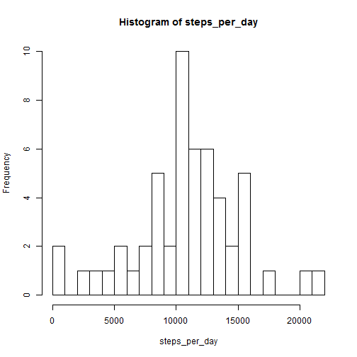
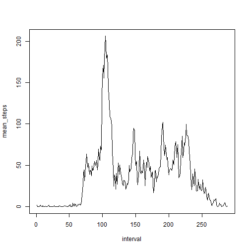
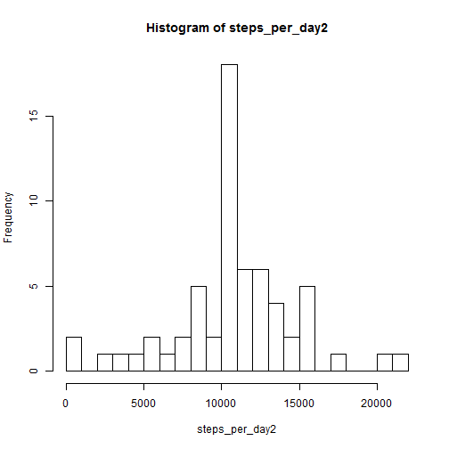
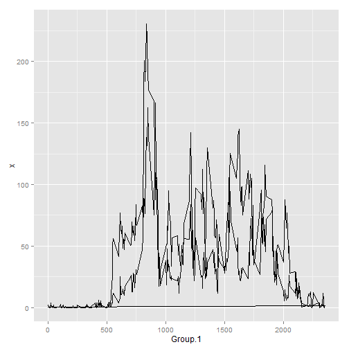

# Reproducible Research: Peer Assessment 1

## Loading and preprocessing the data


```r
Sys.setlocale("LC_TIME", "English")
```

```
## [1] "English_United States.1252"
```

```r
data <- read.csv(unz("activity.zip", "activity.csv"))
```


## What is mean total number of steps taken per day?


```r
steps_per_day = aggregate(data$steps, by = list(data$date), sum, rm = TRUE)[, 
    2]
hist(steps_per_day, breaks = 20)
```

 

```r
mean(steps_per_day, na.rm = TRUE)
```

```
## [1] 10767
```

```r
median(steps_per_day, na.rm = TRUE)
```

```
## [1] 10766
```


## What is the average daily activity pattern?


```r
steps_per_interval = aggregate(data$steps, by = list(data$interval), mean, na.rm = TRUE)
plot(steps_per_interval[, 2], type = "l", xlab = "interval", ylab = "mean_steps")
```

 

```r
steps_per_interval[which.max(steps_per_interval[, 2]), 1]
```

```
## [1] 835
```


## Imputing missing values


```r
sum(is.na(data$steps))
```

```
## [1] 2304
```

```r
data2 = data
data2[is.na(data2$steps), 1] = steps_per_interval[, 2]
steps_per_day2 = aggregate(data2$steps, by = list(data2$date), sum, rm = TRUE)[, 
    2]
hist(steps_per_day2, breaks = 20)
```

 

```r
mean(steps_per_day2, na.rm = TRUE)
```

```
## [1] 10767
```

```r
median(steps_per_day2, na.rm = TRUE)
```

```
## [1] 10767
```


## Are there differences in activity patterns between weekdays and weekends?


```r
data2$weekday = factor(ifelse(weekdays(as.Date(data2$date)) %in% c("Saturday", 
    "Sunday"), "weekend", "weekday"))
steps_per_interval2 = aggregate(data2$steps, by = list(data$interval, data2$weekday), 
    mean, na.rm = TRUE)
names(steps_per_interval2) = c("interval", "weekday", "steps")
library(lattice)
xyplot(steps ~ interval | weekday, steps_per_interval2, type = "l")
```

 

